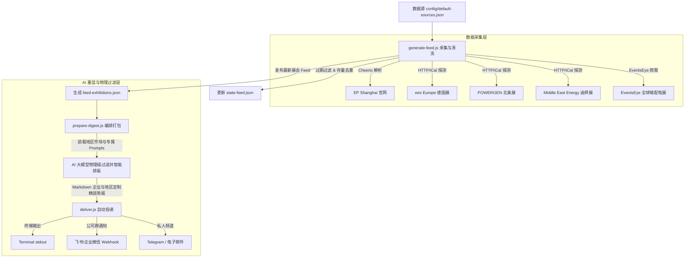

# ⚡️ 电力行业展会雷达 (Power Exhibition Tracker - 动态版)

本系统是一个基于 AI 的中高压输配电、智能开关柜及电网设备最新展会及技术要闻追踪雷达。

本系统支持**完全动态的企业画像定制与区域市场强力过滤**。系统防噪音机制让用户能真正实现按需推送。系统承袭了 **`follow-builders`** 经典的高内聚低耦合设计思想：

*   **中央调度引擎**：每天自动拉取国内外最核心的输配电及储能大展（EP Shanghai / MEE 迪拜展 / POWERGEN 北美展 / ees 欧洲展）、专业贸易展会目录（EventsEye），生成去重且剔除过期的静态 JSON。
*   **企业画像与地区市场重混 (LLM Remix & Filtering)**：大模型基于用户在本地配置文件中动态定义的**主营产品**、**目标采购巨头**，以及**目标地区市场**。自动对抓取到的展会列表进行**物理级硬核过滤**，只推送目标地区范围内的展会，杜绝无关信息噪音。
*   **多端智能投递**：排版优雅的 Markdown 精报可推送到 **控制台 stdout**、**Telegram 个人频道**、**Resend 个人邮箱**，以及专为企业协作适配的 **飞书群/企业微信群机器人 Webhook**。

---

## 🏗 系统架构与数据流



---

## 🚀 快速上手 (Quick Start)

### 1. 环境准备
确保你的本地安装了 Node.js (v18+)。在项目 `scripts` 目录安装依赖：
```bash
cd power-expo-tracker/scripts
npm install
```

### 2. 本地执行测试
你可以随时通过命令行手动触发数据更新：
```bash
# 1. 采集并清洗最新展会数据，生成静态 feed
node generate-feed.js

# 2. 编排打包 LLM 数据包（包括展会源、个人配置、提示词模板）
node prepare-digest.js
```

---

## 🛠 配置文件说明

### 1. 用户个性化配置与动态企业画像：`~/.power-expo-tracker/config.json`
在用户家目录创建配置目录，用以存放你的交付偏好、**动态企业自画像及目标区域市场**：
```json
{
  "language": "zh", 
  "sectors": ["all"],
  "delivery": {
    "method": "feishu",
    "feishuWebhookUrl": "https://open.feishu.cn/open-apis/bot/v2/hook/xxxx"
  },
  "companyProfile": {
    "name": "某某变压器及电网配电设备有限公司",
    "type": "中高压电力变压器与输配网设备制造厂商",
    "products": ["干式变压器", "油浸式变压器", "箱式变电站", "绝缘件"],
    "targetOems": ["西门子", "施耐德", "ABB", "国家电网"],
    "targetRegions": ["国内", "欧洲", "中东"]
  },
  "onboardingComplete": true
}
```
*   `language`: 支持 `"zh"`（纯中文）、`"en"`（纯英文）和 `"bilingual"`（双语对照段落级排版）。
*   `companyProfile`: **动态企业配置**。
    *   `name`: 企业名称。
    *   `type`: 核心定位/行业分类。
    *   `products`: 核心产品类别列表，AI 会据此筛选最契合的技术趋势。
    *   `targetOems`: 核心要追踪的 Tier-1 大型 OEM 采购商列表。
    *   `targetRegions`: **目标区域市场过滤网**。支持的值为：`"国内"` (中国大陆/台港澳)、`"北美"` (美加墨)、`"欧洲"` (德法英意等)、`"中东"` (阿联酋沙特等)、`"东南亚"` (泰越印尼等)、`"all"` (不进行任何过滤)。**不在该配置列表内的地区展会将自动被 AI 物理剔除，零打扰**。

### 2. API 密钥配置：`~/.power-expo-tracker/.env`
如果启用了 Telegram 或 Resend 邮件投递，需要在用户配置的 `.env` 中填写对应的 API Key：
```bash
# Telegram 配置
TELEGRAM_BOT_TOKEN=your_telegram_bot_token

# Resend 邮件配置
RESEND_API_KEY=your_resend_api_key

# 飞书/企业微信群机器人 Webhook (也可以直接写在 config.json 里)
FEISHU_WEBHOOK_URL=your_feishu_webhook_url
WECOM_WEBHOOK_URL=your_wecom_webhook_url
```

---

## 📝 大模型动态重混与过滤规则 (`prompts/` 目录)

系统提供三套高水准的英文/中文混合 Prompt 控制大模型输出：
1.  `summarize-exhibitions.md`：**动态重混与地理过滤规则**。指示 AI 自动读取 `config.companyProfile.targetRegions` 字段，对展会列表进行严格的物理屏蔽，并对剩余展会进行绝缘/智能柜深度分析。
2.  `digest-intro.md`：排版骨架设计。设计了精美的 Emoji 系统及数据看板统计。
3.  `translate.md`：行业词汇翻译映射。内置精细的电力词汇字典（如将 “UHV” 精准翻译成 “特高压”、“Switchgear” 翻译成 “开关柜/环网柜”、“Embedded Pole” 翻译成 “固封极柱”），支持双语段落级对照排版。
