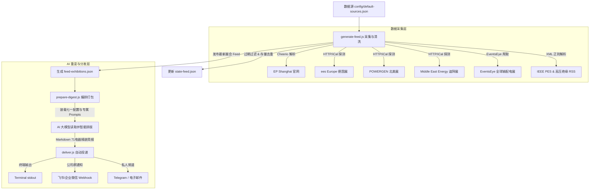

# ⚡️ 电力行业展会雷达 (Power Exhibition Tracker - 71电器专属版)

本系统是一个基于 AI 的中高压输配电、智能开关柜及电网绝缘器件最新展会追踪雷达。它是为 **浙江开化七一电器股份有限公司 (71电器)** 量身定制的全球市场拓展与前沿技术追踪系统。

系统承袭了 **`follow-builders`** 经典的高内聚低耦合设计思想：

*   **中央调度引擎**：每天自动拉取国内外最核心的输配电及储能大展（EP Shanghai / MEE 迪拜展 / POWERGEN 北美展 / ees 欧洲展）、专业贸易展会目录（EventsEye），以及高学术价值的 **IEEE PES 智能电网与大电网会议 (CIGRE/CIRED)** 的 Google News RSS。
*   **71电器专属 AI 重混 (LLM Remix)**：大模型基于七一电器的核心业务——环氧绝缘件（固封极柱、触头盒、套管、绝缘子等）、中高压开关设备（GIS/SIS/空气绝缘）——进行专属商业情报重混。
*   **多端智能投递**：排版优雅的 Markdown 精报可推送到 **控制台 stdout**、**Telegram 个人频道**、**Resend 个人邮箱**，以及专为企业协作适配的 **飞书群/企业微信群机器人 Webhook**。

---

## 🏗 系统架构与数据流



---

## 🚀 快速上手 (Quick Start)

### 1. 环境准备
确保你的本地安装了 Node.js (v18+)。在项目 `scripts` 目录安装依赖：
```bash
cd power-expo-tracker/scripts
npm install
```

### 2. 本地执行测试
你可以随时通过命令行手动触发数据更新：
```bash
# 1. 采集并清洗最新展会数据，生成静态 feed
node generate-feed.js

# 2. 编排打包 LLM 数据包（包括展会源、个人配置、提示词模板）
node prepare-digest.js
```

---

## 🛠 配置文件说明

### 1. 数据源配置：`config/default-sources.json`
包含了针对七一电器绝缘及智能电网零部件产品线量身打造的全球 5 大源与 RSS 订阅：
*   **EP Shanghai 官网**（国内电力电工大展）
*   **Middle East Energy 官网**（中东及非洲最大电力展）
*   **POWERGEN International 官网**（北美最权威发电与配电展）
*   **ees Europe 官网**（欧洲最大储能与电池展，高压接入柜绝缘件增量市场）
*   **EventsEye 输配电专栏**（全球贸易展会结构化目录）
*   **IEEE PES & CIGRE/CIRED 联合 RSS 专线**（高端学术与前沿电网技术论坛）
*   **中高压输配电及绝缘件专线 RSS**（专为开关柜、固封极柱、套管、绝缘子等配置的高时效订阅）

### 2. 用户个性化配置：`~/.power-expo-tracker/config.json`
在用户家目录创建配置目录，用以存放你的交付偏好：
```json
{
  "language": "zh", 
  "sectors": ["all"],
  "delivery": {
    "method": "feishu",
    "feishuWebhookUrl": "https://open.feishu.cn/open-apis/bot/v2/hook/xxxx-xxxx-xxxx"
  }
}
```
*   `language`: 支持 `"zh"`（纯中文）、`"en"`（纯英文）和 `"bilingual"`（双语对照段落级排版）。
*   `delivery.method`: 支持 `"stdout"`、`"telegram"`、`"email"`、`"feishu"`、`"wecom"`。

### 3. API 密钥配置：`~/.power-expo-tracker/.env`
如果启用了 Telegram 或 Resend 邮件投递，需要在用户配置的 `.env` 中填写对应的 API Key：
```bash
# Telegram 配置
TELEGRAM_BOT_TOKEN=your_telegram_bot_token

# Resend 邮件配置
RESEND_API_KEY=your_resend_api_key

# 飞书/企业微信群机器人 Webhook (也可以直接写在 config.json 里)
FEISHU_WEBHOOK_URL=your_feishu_webhook_url
WECOM_WEBHOOK_URL=your_wecom_webhook_url
```

---

## 📝 七一电器专属提示词模板 (`prompts/` 目录)

系统提供三套高水准的英文/中文混合 Prompt 控制大模型输出：
1.  `summarize-exhibitions.md`：核心提取规则。教导 AI 深入分析展会中有关 **开关柜、环保无六氟化硫 (SF6-Free) 绝缘技术、固体绝缘柜、表面屏蔽套管/断路器模块、固封极柱** 的产品首发与标准演进，并自动追踪七一电器的战略合作目标与核心 OEM 客户（**施耐德 Schneider、伊顿 Eaton、西门子 Siemens、东芝 Toshiba、ABB、国家电网、南方电网**）的最新动态。
2.  `digest-intro.md`：排版骨架设计。设计了精美的 Emoji 系统及数据看板统计。
3.  `translate.md`：行业词汇翻译映射。内置精细的电力词汇字典（如将 “UHV” 精准翻译成 “特高压”、“Switchgear” 翻译成 “开关柜/环网柜”、“Embedded Pole” 翻译成 “固封极柱”），支持双语段落级对照排版。
